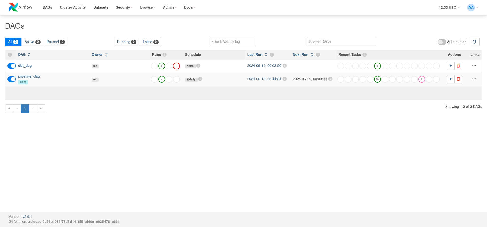

# divvy_bike_trip_data

The purpose of the project is to gather, transform and visualize historical trip data of Divvy Chicagoland's bike share 
system (https://divvybikes.com) that is available to the public at:  
https://divvybikes.com/system-data  
and more precisely, in the bucket:  
https://divvy-tripdata.s3.amazonaws.com/index.html

This project could be the base for getting insights about bike trips: their durations, start and end locations, 
distribution of rides over months, days of week, time of day, etc.

## Init

In order to run project execute command:
```
docker compose up
```

Build docker image - otherwise dependencies defined in requirements will be fetched each time on startup.
```
docker build . --tag=airflow_divvy:latest
```

Then change image in .env.local (create this file if not exists):
```
AIRFLOW_IMAGE_NAME=airflow_divvy:latest
```

## Services

#### Airflow
[http://127.0.0.222:8080]()  
Login with: airflow / airflow

#### Metabase:  
[http://127.0.0.223:3030]()  
Login with: admin@admin.com / Admin333!

#### DBT documentation
[http://127.0.0.224:8080]()

#### Airflow & DWH database
127.0.0.222:5432
User: airflow  
Db: airflow  
Pass: airflow  

#### Metabase database
127.0.0.223:5432  
User: metabase  
Db: metabase  
Pass: metabase  

## Technology stack and features

- ⚡ Apache Airflow as a job orchestrator
- 💾 PostgreSQL as the SQL database
- 🗂️ DBT for transformation of data
- ✅ Model tests with DBT
- 🖥️ Nginx for serving DBT documentation
- 📊 Charts and data analysis with Metabase
- 🐋 Docker Compose for development

## How to use it

## Airflow

### DAG list

[](https://github.com/brodi-333/divvy_bike_trip_data)
